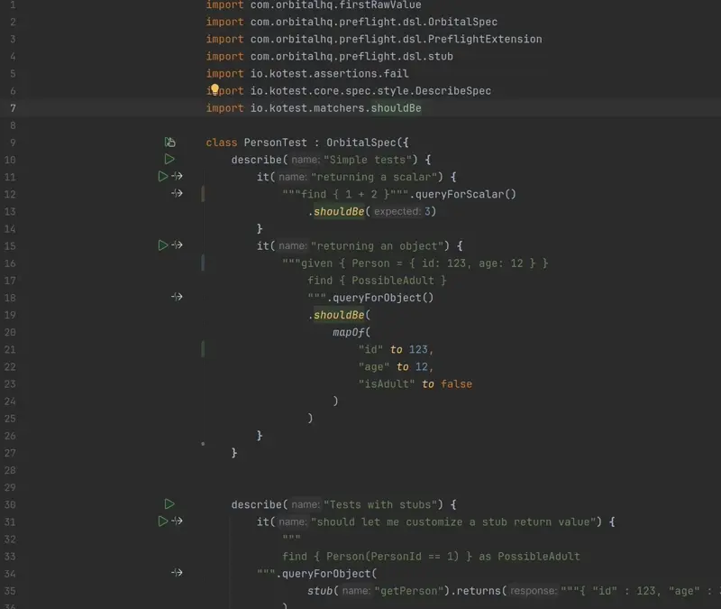

# Preflight - A Taxi / Orbital testing tool

Preflight is a tool for writing unit and integration tests for Taxi projects

It's built in Kotlin, and is a lightweight wrapper around [Kotest](https://kotest.io/)'s [DescribeSpec](https://kotest.io/docs/framework/testing-styles.html#describe-spec).



The underlying test framework is the same one that the [Orbital](https://orbitalhq.com) team uses for the tests in the [Orbital codebase](https://github.com/orbitalapi/orbital).

It supports:
* Compiling Taxi projects
* Testing Taxi queries
* Stubbing data sources
* (Planned): Running against real data sources using [Nebula](https://nebula.orbitalhq.com) in tests is planned [#2]

## Adding Preflight to your Taxi project

> [!NOTE]
> Currently, there's more boilerplate here then we'd want -- that's
> because the Taxi and Orbital libraries aren't available on Maven Central

Currently, Preflight tests are executed using Gradle.
We have a gradle plugin that handles most of the wiring.

```kotlin build.gradle.kts
// build.gradle.kts
plugins {
    id("com.orbitalhq.preflight")
}
```

## Configuration

### Orbital Version
By default, Preflight uses Orbital version `0.36.0-M9`. You can configure which version of Orbital to test against using the `preflight` extension:

```kotlin
// build.gradle.kts - uses default Orbital version (0.36.0-M9)
plugins {
    id("com.orbitalhq.preflight")
}

// OR specify a custom Orbital version
preflight {
    orbitalVersion = "0.37.0"
}
```

**Benefits of configurable versions:**
- Test against different Orbital versions without changing plugin code
- Taxi dependencies come transitively from Orbital, ensuring compatibility
- Easy to upgrade/downgrade versions for testing
- No dependency version conflicts

### On Taxi CLI vs Gradle
We plan to provide full support for executing tests using the Taxi CLI, which will make Gradle optional for CI/CD purposes.

However, the Preflight Gradle Plugin offers additional benefits beyond test execution:
- Configures IntelliJ source roots for better IDE integration
- Enables Kotlin code completion when writing tests
- Provides a seamless development experience within existing Gradle projects

> **Note**: Code completion is available for Kotlin test code only. IntelliJ does not currently support code completion for Taxi schema files.

For this reason, we plan to support both approaches:
- **Gradle Plugin**: Recommended for development due to superior IDE experience
- **Taxi CLI**: Ideal for lightweight CI/CD pipelines and standalone execution

## Writing tests
Tests are written using Kotlin, following Kotest's [Describe spec](https://kotest.io/docs/framework/testing-styles.html#describe-spec) style.

A custom base class of `OrbitalSpec` is provided, which provides several convenience functions to make testing easier:

```kotlin
class PersonTest : OrbitalSpec({
    describe("Simple tests") {
        it("returning a scalar") {
            """find { 1 + 2 }""".queryForScalar()
                .shouldBe(3)
        }
    }
})
```

### Compiling your Taxi project
By default, the taxi project is compiled before any tests are run. If compilation fails, the tests are not executed.

### Test helpers
The `OrbitalSpec` base class provides several query helper methods that make testing easier:

#### Query Methods
All query methods accept a Taxi query string and return the result in different formats:

- **`queryForScalar():Any?`** - Returns the first result from the query as a raw scalar values (Int, String, Boolean, etc.)
- **`queryForObject():Map<String,Any?>`** - Returns the first result from the query as a `Map<String,Any?>`
- **`queryForCollection():List<Map<String,Any?>>`** - Returns a collection of objects/entities
- **`queryForTypedInstance():TypedInstance`** - **(Advanced usage only)** Returns Orbital's internal `TypedInstance`, which provides access to data sources (including lineage tracing) and error messages. Normally, you'd call `queryForObject()`  

#### Basic Usage
```kotlin
class PersonTest : OrbitalSpec({
    describe("Simple tests") {
        it("returning a scalar") {
            """find { 1 + 2 }""".queryForScalar()
                .shouldBe(3)
        }
        
        it("returning an object") {
            """given { Person = { id: 123, age: 12 } }
                find { PossibleAdult }    
                """.queryForObject()
                .shouldBe(
                    mapOf(
                        "id" to 123,
                        "age" to 12,
                        "isAdult" to false
                    )
                )
        }
    }
})
```

#### Stubbing External Dependencies
Each query method supports stubbing external data sources in two ways:

**1. Using Stub Scenarios (Recommended)**
```kotlin
it("should let me customize a stub return value") {
    """
    find { Person(PersonId == 1) } as PossibleAdult
    """.queryForObject(
        stub("getPerson").returns("""{ "id" : 123, "age" : 36 }""")
    )
        .shouldBe(mapOf(
            "id" to 123,
            "age" to 36,
            "isAdult" to true
        ))
}
```


**2. Using Stub Customizer (Advanced)**

```kotlin
it("advanced stub customization") {
    """find { Person(PersonId == 1) }""".queryForObject { stubService ->
        // Fine-grained control over stub configuration
        stub.addResponse("getPerson", """{ "id" : 123, "age" : 36 }""") 
    }
}
```

The stub scenarios approach is more convenient for most use cases, while the stub customizer allows for things like
 - controlling responses based on inputs
 - streaming responses (for faking Kafka topics, etc)
 - Throwing errors / simulating failures

### Convenience accessors
`OrbitalSpec` also makes the following accessors available:

 * `taxi`: The low-level Taxi compiled document
 * `schema`: Access to Orbital's Schema instance - which provides a higher-level abstraction over the compiled Taxi document
 * `taxiProject`:  Provides access to the Taxi Package Project - taxi's taxi.conf file, and source roots, etc.

### Project layout
```
my-project/
├─ src/
│  ├─ person.taxi
├─ test/  <--- tests go here (by convention)
│  ├─ PersonTest.kt
├─ taxi.conf
├─ build.gradle.kts
├─ settings.gradle.kts
```

### Assertions
Assertions are written using [Kotest Assertions](https://kotest.io/docs/assertions/assertions.html)

## Running tests
Currently, tests are executed using Gradle

### Running tests with Gradle

### Running tests in IntelliJ
Preflight is a simple wrapper around Kotest.

```bash
gradle test
```


## TODO:
Here's a list of things we plan to cover as part of a 1.0 release

 - [ ] Publish to [Gradle Plugin Portal](https://plugins.gradle.org/)
 - [ ] Get all required dependencies (Orbital / Taxi) on Maven Central, to reduce `repository` boilerplate
 - [ ] Support for mixed-source Taxi projects (Avro, Protobuf, OAS, etc)
 - [ ] Nebula support
 - [ ] Integration with Taxi CLI (making gradle usage optional)
 - [ ] Update docs on [Orbital docs](https://orbitalhq.com/docs)
 - [ ] Copy to / from [Taxi Playground](https://playground.taxilang.org)
 - [ ] [Data driven tests](https://kotest.io/docs/framework/datatesting/data-driven-testing.html) with simple config files