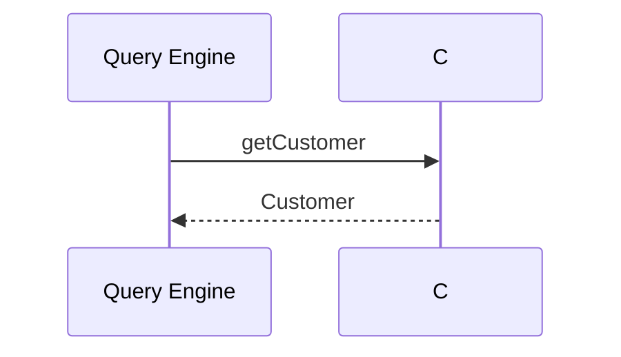

# Spec files

In addition to [writing tests using Kotlin](/writing-tests), tests can be authored in markdown spec file.

Spec files are markdown files that define a test as a self-contained document. Each `.spec.md` file describes a single test case: the query to run, the stubbed data sources, and the expected result.

Spec files serve as both living documentation and executable tests. They render nicely on GitHub and in documentation tools, while Preflight parses and runs them automatically.

## File convention

Spec files must:
- Have the `.spec.md` extension
- Be placed under `test-resources/specs/` (including subdirectories)

```
├── src/
│   └── schema.taxi
├── test-resources/
│   └── specs/
│       ├── customer-lookup.spec.md
│       └── orders/
│           └── order-flow.spec.md
├── taxi.conf
└── build.gradle.kts
```

No Kotlin test code is needed. The Preflight Gradle plugin automatically generates a test runner that discovers and executes all spec files.

## Spec file format

Every spec file has the same structure:

````markdown
---
spec-version: 0.1
---

# Test name

Optional description paragraph.

## Query

```taxiql
find { Customer( CustomerId == "C-100" ) } as CustomerProfile
```

## Data Sources

### Customer API
<!-- operation: getCustomer -->

Response:
```json
{ "id": "C-100", "name": "Alice Smith", "age": 30 }
```

## Expected Result

```json
{ "id": "C-100", "name": "Alice Smith", "age": 30, "isAdult": true }
```
````

### Front matter

The `---` delimited block at the top is required. Currently the only field is `spec-version`, which must be `0.1`.

### Test name and description

The `# H1` heading becomes the test name. Any prose between the H1 and the first H2 is captured as an optional description.

### Query

The `## Query` section contains a fenced code block with the TaxiQL query to execute.

### Data Sources

The `## Data Sources` section contains one or more `### H3` sub-sections, each representing a stubbed operation.

Each stub needs an HTML comment directive immediately after the heading that identifies the operation:

```markdown
### My Stub
<!-- operation: getCustomer -->
```

The `operation` value must match a Taxi operation name defined in your schema.

#### Request-response stubs

For standard request-response operations, add a `Response:` label followed by a JSON code block:

````
### Customer API
<!-- operation: getCustomer -->

Response:
```json
{ "id": "C-100", "name": "Alice Smith" }
```
````

#### Stream stubs

For streaming operations (e.g. Kafka topics), add `mode: stream` to the directive and use `Message:` labels:

````markdown
### Price Stream
<!-- operation: priceStream, mode: stream -->

Message:
```json
{ "price": 100 }
```

Message:
```json
{ "price": 200 }
```
````
Stream stubs must have at least one `Message:` block.

### Expected Result

The `## Expected Result` section contains the JSON you expect the query to produce. Preflight compares the actual query result against this JSON structurally.

If the expected result is a JSON array, the query is executed as a collection query. If it's an object, it's executed as a single-object query.

#### Result format qualifier

The code block info string supports an optional qualifier to indicate the JSON format:

| Info string | Meaning |
|---|---|
| `` ```json `` | Plain JSON (default) |
| `` ```json typedInstance `` | Orbital TypedInstance JSON |

The `typedInstance` qualifier is used when the expected result includes Orbital metadata like `type` and `dataSourceId`.

## Adding additional information

Headings other than those described in this doc are ignored, so you can add your own text, including references to issues, and even mermaid sequence diagrams - anything that markdown supports

````markdown
## Flow


````


## Running spec tests

Spec tests run automatically as part of `gradle test`. No additional configuration is needed.

```bash
gradle test
```

The Preflight Gradle plugin generates a test runner class behind the scenes that discovers all `.spec.md` files in `test-resources/specs/` and executes them.

### Debugging .spec.md files
If you want to run spec tests from IntelliJ with the gutter play button, add a one-line Kotlin class:

```kotlin
// test/RunMarkdownSpecs.kt
import com.orbitalhq.preflight.dsl.MarkdownSpec

class RunMarkdownSpecs : MarkdownSpec()
```

This is optional - `gradle test` works without it.

## Generating spec files with the API

The `preflight-spec` library provides `TestSpecWriter` and `TestSpecReader` for programmatically creating and parsing spec files. This is useful for tooling that captures test scenarios automatically.

### Writing a spec file

```kotlin
import com.orbitalhq.preflight.spec.*

val spec = TestSpec(
    specVersion = "0.1",
    name = "Adult customer is identified correctly",
    description = "Verifies that a customer over 18 is correctly identified as an adult.",
    query = "find { Customer( CustomerId == \"C-100\" ) } as CustomerProfile",
    dataSources = listOf(
        Stub(
            label = "Customer API",
            operationName = "getCustomer",
            mode = StubMode.REQUEST_RESPONSE,
            response = """{ "id": "C-100", "name": "Alice Smith", "age": 30 }""",
            messages = null
        )
    ),
    expectedResult = """{ "id": "C-100", "name": "Alice Smith", "age": 30, "isAdult": true }""",
    flow = null
)

// Write to string
val markdown = TestSpecWriter.write(spec)

// Or write directly to a file
TestSpecWriter.writeFile(spec, Path.of("test-resources/specs/adult-customer.spec.md"))
```

### Stream stubs

For streaming data sources, use `StubMode.STREAM` with `messages` instead of `response`:

```kotlin
val streamStub = Stub(
    label = "Price Stream",
    operationName = "priceStream",
    mode = StubMode.STREAM,
    response = null,
    messages = listOf(
        """{ "price": 100 }""",
        """{ "price": 200 }""",
        """{ "price": 300 }"""
    )
)
```

### TypedInstance results

To indicate that the expected result uses Orbital's TypedInstance format, set `resultFormat`:

```kotlin
val spec = TestSpec(
    specVersion = "0.1",
    name = "Typed result test",
    description = null,
    query = "find { Customer }",
    dataSources = listOf(/* ... */),
    expectedResult = """{ "type": "Customer", "value": { "name": "Alice" } }""",
    resultFormat = ResultFormat.TYPED_INSTANCE,
    flow = null
)
```

This produces a code block with the `json typedInstance` info string:

````markdown
## Expected Result

```json typedInstance
{ "type": "Customer", "value": { "name": "Alice" } }
```
````

### Reading a spec file

```kotlin
import com.orbitalhq.preflight.spec.TestSpecReader

// Parse from string
val spec = TestSpecReader.read(markdownContent)

// Or read from a file
val spec = TestSpecReader.readFile(Path.of("test-resources/specs/my-test.spec.md"))

// Access parsed data
println(spec.name)           // "Adult customer is identified correctly"
println(spec.query)          // "find { Customer(...) } as CustomerProfile"
println(spec.dataSources)    // List of Stub objects
println(spec.expectedResult) // The expected JSON string
println(spec.resultFormat)   // ResultFormat.JSON or ResultFormat.TYPED_INSTANCE
```

### Data model reference

```kotlin
data class TestSpec(
    val specVersion: String,       // Must be "0.1"
    val name: String,              // From the H1 heading
    val description: String?,      // Prose between H1 and first H2
    val query: String,             // TaxiQL query
    val dataSources: List<Stub>,   // Stubbed operations
    val expectedResult: String,    // Expected JSON
    val resultFormat: ResultFormat, // JSON or TYPED_INSTANCE
    val flow: String?              // Optional Mermaid diagram
)

data class Stub(
    val label: String,             // From the H3 heading
    val operationName: String,     // From the <!-- operation: ... --> directive
    val mode: StubMode,            // REQUEST_RESPONSE or STREAM
    val response: String?,         // JSON response (request-response mode)
    val messages: List<String>?    // JSON messages (stream mode)
)
```
